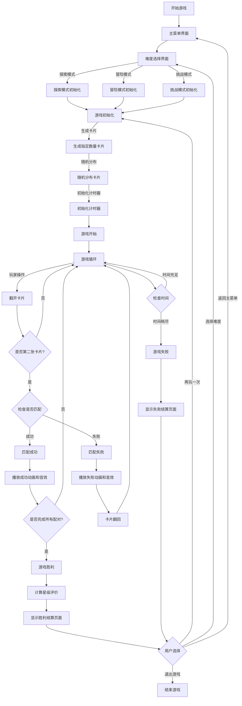

# 🚀 太空探险记忆翻翻乐 - 游戏策划案 & 产品需求文档

## 文档说明
- **版本**：v1.1.0
- **最后更新**：2024-05
- **文档状态**：最终版
- **文档作者**：产品团队
- **文档目的**：为UI设计师、动画设计师、音效师和开发团队提供详细的开发规范和需求

## 目录
1. [项目概述](#1-项目概述)
2. [游戏系统](#2-游戏系统)
3. [用户界面设计](#3-用户界面设计)
4. [交互与动画](#4-交互与动画)
5. [音效与音乐](#5-音效与音乐)
6. [开发技术规范](#6-开发技术规范)
7. [游戏文案设计](#7-游戏文案设计)

## 1. 项目概述

### 1.1 产品定位
- **产品类型**：HTML5网页小游戏
- **游戏类型**：儿童教育类记忆配对游戏
- **目标用户**：5-10岁儿童
- **设备支持**：PC、平板和移动设备
- **核心玩法**：太空主题的卡片配对记忆游戏

### 1.2 游戏背景
玩家作为小小太空探险家，通过完成不同难度的记忆配对任务，收集能量，探索太空。游戏设计围绕太空探险的主题，创造一个有趣且富有教育意义的体验。

### 1.3 项目价值
- **教育价值**：提升儿童记忆力、注意力和认知能力
- **娱乐价值**：太空探险主题带来趣味性和沉浸感
- **社交价值**：鼓励亲子互动，支持成就分享

### 1.4 核心特色
1. **三级难度系统**：适应不同年龄段儿童的认知能力
2. **儿童友好界面**：色彩丰富、操作简单的交互设计
3. **实时反馈系统**：积极的视觉和音效反馈
4. **渐进式学习曲线**：从简单到复杂的游戏进阶

## 2. 游戏系统

### 2.1 核心玩法循环

#### 主循环设计
```
探索 → 记忆 → 配对尝试 → 反馈 → 探索下一关
```

#### 玩法详解
1. **探索阶段**：玩家选择难度进入游戏，观察并记忆卡片位置
2. **记忆阶段**：尝试记住卡片的位置和内容
3. **配对阶段**：翻开卡片，寻找匹配的单词和图像对
4. **反馈循环**：
   - 成功匹配：获得正向反馈，卡片保持翻开
   - 匹配失败：获得提示，卡片翻回，继续尝试
5. **进阶机制**：完成当前难度后解锁下一难度

#### 玩家目标层次
- **短期目标**：找到匹配的卡片对
- **中期目标**：在时间限制内完成当前难度
- **长期目标**：获得高星级评价，完成所有难度

### 2.2 难度设计

#### 探索模式（5-7岁）
- **卡片数量**：4张（2对）
- **时间限制**：120秒
- **教学元素**：
  - 自动突出显示可点击的卡片
  - 简化的单词-图像配对
  - 详细的操作引导提示
  - 每30秒自动提示
  - 更多鼓励性反馈

#### 冒险模式（7-9岁）
- **卡片数量**：6张（3对）
- **时间限制**：90秒
- **挑战元素**：
  - 中等难度的单词-图像关联
  - 减少引导提示频率
  - 每45秒自动提示
  - 平衡的反馈机制

#### 挑战模式（9-10岁）
- **卡片数量**：8张（4对）
- **时间限制**：60秒
- **挑战元素**：
  - 更复杂的单词-图像关联
  - 最小化提示系统
  - 无自动提示
  - 强调成就反馈

### 2.3 评分系统

#### 星级评价机制
1. **三星评价**
   - **条件**：完成时间 ≤ 设定时间的50%
   - **视觉表现**：三颗金色星星，闪烁动画
   - **音效**：欢快的胜利音乐，持续5秒
   - **特效**：金色星星特效 + 完整的彩带庆祝

2. **二星评价**
   - **条件**：完成时间 ≤ 设定时间的80%
   - **视觉表现**：两颗银色星星，轻微闪烁
   - **音效**：中等欢快的胜利音乐，持续3秒
   - **特效**：银色星星特效 + 基础彩带庆祝

3. **一星评价**
   - **条件**：完成时间 > 设定时间的80%
   - **视觉表现**：一颗铜色星星，无特殊动画
   - **音效**：简单的完成音效，持续2秒
   - **特效**：铜色星星特效 + 简单庆祝效果

### 2.4 游戏流程

#### 主要状态流转
```
选择难度 → 游戏初始化 → 游戏进行 → 成功/失败判定 → 结算界面 → 继续/返回选择
```

#### 完整游戏流程图


#### 游戏流程详解
1. **进入游戏**：玩家从主界面进入难度选择界面
2. **选择难度**：选择探索、冒险或挑战模式
3. **游戏初始化**：
   - 生成指定数量的卡片对
   - 随机分布卡片在游戏区域
   - 初始化计时器和进度显示
4. **游戏进行**：
   - 玩家翻开卡片查看内容
   - 尝试匹配单词和对应图像
   - 成功匹配时卡片保持翻开状态，伴有正反馈
   - 失败匹配时卡片翻回并继续，伴有负反馈
5. **游戏结束条件**：
   - 成功：所有卡片对都被成功匹配
   - 失败：倒计时结束前未完成匹配
6. **结算界面**：
   - 显示用时和星级评价
   - 提供继续或返回选项
   - 展示成就和奖励

### 2.5 游戏规则

#### 基本规则
1. **卡片翻转机制**
   - 玩家每次只能翻开两张卡片
   - 翻开的卡片会显示其正面内容（单词或图像）
   - 配对成功的卡片保持正面朝上
   - 配对失败的卡片延迟0.8秒后自动翻回

2. **配对判定规则**
   - 有效配对：单词与其对应的图像
   - 成功时：卡片保持翻开并变为不可点击
   - 失败时：卡片短暂晃动，然后翻回背面

3. **倒计时机制**
   - 各难度有不同的时间限制
   - 倒计时显示在界面顶部
   - 剩余30%时间时倒计时变红并闪烁，向上取整数
   - 时间耗尽表示关卡失败

## 3. 用户界面设计

### 3.1 总体界面风格

#### 设计风格
- **主题**：太空探险
- **风格**：扁平化、色彩丰富、适合儿童
- **色彩**：深空背景配以明亮的功能元素
- **布局**：垂直分区，重点突出游戏区域


### 3.2 主要界面设计

#### 主页面
- **布局**：垂直分布，突出主标题和开始按钮
- **元素**：
  - 游戏标题："太空探险记忆翻翻乐"
  - 开始按钮："开始探索"
  - 帮助和设置按钮
  - 星空背景动画效果
- **交互**：按钮悬停放大效果，点击跳转到难度选择

#### 难度选择界面
- **布局**：三个难度卡片垂直排列
- **元素**：
  - 页面标题："选择你的探险模式"
  - 三个难度卡片：
    1. 探索模式（适合5-7岁）
    2. 冒险模式（适合7-9岁）
    3. 挑战模式（适合9-10岁）
  - 返回按钮
- **交互**：卡片悬停效果，点击选择难度并进入游戏

#### 游戏界面
- **布局**：垂直三区域，比例2:8:1
- **元素**：
  1. **顶部信息栏**：
     - 进度显示："探索进度：X/Y"
     - 倒计时："XXs"
     - 进度条
  2. **游戏主区域**：
     - 卡片网格（根据难度2×2、3×2或4×2）
     - 消息提示区
  3. **底部控制栏**：
     - 开始/重新开始按钮
- **交互**：卡片点击翻转，按钮控制游戏流程

#### 结算界面
- **布局**：中央垂直排列
- **元素**：
  - 结果标题（成功/失败）
  - 星级评价（1-3颗星）
  - 用时显示
  - 鼓励文字
  - 继续/重试/返回按钮
- **交互**：星星出现动画，按钮选择后续行动

### 3.3 卡片设计
#### 卡片尺寸与布局
- **尺寸**：120px × 160px（桌面版）
- **布局**：根据难度变化
  - 探索模式：2×2布局（4张卡片）
  - 冒险模式：3×2布局（6张卡片）
  - 挑战模式：4×2布局（8张卡片）
- **间距**：卡片之间保持15px的间距

#### 卡片类型
1. **文字卡片**
   - 内容：英文单词，首字母大写

2. **图像卡片**
   - 内容：对应单词的表情符号或图像
   - 背景：浅绿色渐变 (#e6ffee → #ccffdd)
   - 图像尺寸：居中，占卡片内容区的60-70%

#### 卡片背面设计
- 统一的太空主题图案

## 4. 交互与动画
### 4.1 基础交互
#### 卡片交互
- **默认状态**：显示卡片背面，可点击
- **点击效果**：执行翻转动画，显示正面
- **匹配成功**：
  - 卡片保持翻开状态
  - 播放成功动画和音效
- **匹配失败**：
  - 卡片短暂晃动
  - 延迟0.8秒后翻回
  - 播放失败音效

#### 按钮交互
- **默认状态**：原始尺寸，标准阴影
- **悬停效果**：轻微放大(1.05倍)，增强阴影
- **点击效果**：按下效果(scale 0.97)，播放点击音效
- **禁用状态**：降低透明度(0.5)，移除悬停效果

### 4.2 核心动画
#### 卡片翻转动画
- **类型**：3D翻转(Y轴)
- **持续时间**：0.3秒
- **缓动函数**：ease-out
- **详细规格**：
  ```css
  transform-style: preserve-3d;
  transition: transform 0.3s ease-out;
  transform: rotateY(180deg); /* 翻转状态 */
  ```

#### 匹配失败晃动动画
- **类型**：横向晃动
- **持续时间**：0.3秒
- **晃动幅度**：8px左右
- **详细规格**：
  ```css
  @keyframes shake {
    0%, 100% { transform: translateX(0); }
    20%, 60% { transform: translateX(-8px); }
    40%, 80% { transform: translateX(8px); }
  }
  animation: shake 0.3s ease-in-out;
  ```

#### 匹配成功动画
- **类型**：彩带效果
- **持续时间**：1.5秒
- **效果元素**：
  - 周围彩带粒子效果
- **详细规格**：
  - 边框：0 0 10px #4CAF50 box-shadow
  - 彩带：30个随机彩色粒子，放射状飞出

#### 倒计时紧急提示动画
- **触发条件**：剩余时间≤30%
- **类型**：颜色变化 + 闪烁
- **效果**：
  - 颜色变为红色 (#ff4757)
  - 透明度1.0 → 0.7 → 1.0循环
- **详细规格**：
  ```css
  color: #ff4757;
  animation: pulse 1s infinite;
  ```

### 4.3 系统反馈动画
#### 进度更新动画
- **触发**：每次成功匹配后
- **类型**：进度条平滑增长
- **持续时间**：0.3秒
- **效果**：进度条填充宽度平滑过渡
- **详细规格**：
  ```css
  transition: width 0.3s ease-out;
  ```

#### 星级评价动画
- **触发**：完成难度后
- **类型**：星星依次出现
- **持续时间**：每颗星0.5秒，间隔0.3秒
- **效果**：
  - 星星缩放从0到1
  - 星星根据等级显示不同颜色
  - 三星时添加光芒四射效果

#### 胜利庆祝动画
- **触发**：完成所有卡片匹配
- **类型**：全屏特效
- **持续时间**：3秒
- **效果元素**：
  - 彩带从屏幕上方飘落
  - 屏幕中央显示"太棒了！"
  - 星星依次出现
  - 背景轻微闪烁

## 5. 音效与音乐
### 5.1 背景音乐
#### 主界面音乐
- **风格**：轻快、神秘、太空主题
- **情绪**：好奇、探索
- **长度**：30-60秒循环
- **音量**：中低音量，不干扰用户操作
- **播放逻辑**：进入主界面自动播放，循环

#### 游戏中背景音乐
- **风格**：节奏稳定、轻松、专注
- **情绪**：轻松愉快
- **长度**：60-90秒循环
- **音量**：低音量，避免分散注意力
- **播放逻辑**：游戏开始自动播放，结束时淡出

### 5.2 交互音效
#### 卡片音效
1. **卡片翻转音效**
   - **类型**：简短清脆的翻页声
   - **持续时间**：0.2秒
   - **触发**：点击卡片时
   - **设计风格**：轻快、不突兀

2. **匹配成功音效**
   - **类型**：欢快的成功音
   - **持续时间**：0.5秒
   - **触发**：成功匹配卡片对
   - **设计风格**：积极、鼓励

3. **匹配失败音效**
   - **类型**：轻微的失败提示音
   - **持续时间**：0.3秒
   - **触发**：匹配失败时
   - **设计风格**：温和、不消极

#### 按钮音效
- **点击音效**：简短的点击反馈音
- **确认音效**：积极的确认音
- **返回音效**：简单的返回提示音

### 5.3 系统反馈音效

#### 时间相关音效
1. **倒计时紧急提示音**
   - **触发**：剩余时间≤30%
   - **类型**：轻微的滴答声
   - **间隔**：每秒一次
   - **设计风格**：引起注意但不惊吓

2. **时间结束音效**
   - **触发**：倒计时归零
   - **类型**：温和的结束提示音
   - **持续时间**：1.5秒
   - **设计风格**：清晰但不负面

#### 成就音效
1. **难度完成音效**
   - **触发**：完成当前难度
   - **类型**：欢快的成功旋律
   - **持续时间**：2秒
   - **设计风格**：积极、庆祝

2. **星级奖励音效**
   - **触发**：显示星级时
   - **类型**：星星出现的清脆声音
   - **持续时间**：每颗星0.3秒
   - **设计风格**：闪亮、积极

3. **胜利音效**
   - **触发**：完成最高难度
   - **类型**：盛大的庆祝音乐
   - **持续时间**：5秒
   - **设计风格**：欢快、成就感

## 6. 开发技术规范

### 6.1 前端技术栈
- **基础技术**：HTML5 + CSS3 + JavaScript
- **动画技术**：CSS3 Animations + Web Animation API
- **响应式设计**：媒体查询 + Flexbox/Grid布局
- **音频处理**：Web Audio API

### 6.2 代码组织

#### 文件结构
```
project/
├── index.html          # 主入口
├── pages/              # 页面文件
│   ├── home.html       # 主页
│   ├── difficulty.html # 难度选择
│   ├── game.html       # 游戏主页面
│   └── settings.html   # 设置页面
├── assets/             # 资源文件
│   ├── images/         # 图片资源
│   ├── sounds/         # 音效资源
│   └── styles/         # 样式文件
├── js/                 # 脚本文件
│   ├── game.js         # 游戏核心逻辑
│   ├── animation.js    # 动画控制
│   ├── sound.js        # 音效控制
│   └── utils.js        # 工具函数
└── css/                # 样式文件
    ├── main.css        # 主样式
    └── animations.css  # 动画样式
```

#### 核心类设计
```javascript
// 游戏核心类
class MemoryGame {
    constructor(difficulty) {
        this.difficulty = difficulty;
        this.timeLimit = this.getTimeLimit();
        this.cardsCount = this.getCardsCount();
        // 其他初始化...
    }
    
    // 初始化游戏
    init() { /* ... */ }
    
    // 开始游戏
    start() { /* ... */ }
    
    // 检查匹配
    checkMatch(card1, card2) { /* ... */ }
    
    // 结束游戏
    end() { /* ... */ }
    
    // 根据难度获取时间限制
    getTimeLimit() { /* ... */ }
    
    // 根据难度获取卡片数量
    getCardsCount() { /* ... */ }
}

// 动画控制类
class AnimationController {
    // 卡片翻转
    flipCard(card) { /* ... */ }
    
    // 匹配成功
    matchSuccess(card1, card2) { /* ... */ }
    
    // 匹配失败
    matchFail(card1, card2) { /* ... */ }
    
    // 倒计时紧急动画
    timerUrgent(timerElement) { /* ... */ }
}

// 音效控制类
class SoundController {
    // 播放背景音乐
    playBackgroundMusic() { /* ... */ }
    
    // 播放卡片翻转音效
    playCardFlip() { /* ... */ }
    
    // 播放匹配成功音效
    playMatchSuccess() { /* ... */ }
    
    // 播放匹配失败音效
    playMatchFail() { /* ... */ }
}
```

### 6.3 性能优化要点

#### 动画性能优化
- 使用CSS `transform` 和 `opacity` 属性代替改变位置和显示
- 使用 `will-change` 提示浏览器优化性能
- 适当使用 `requestAnimationFrame` 来处理复杂动画
- 避免同时执行过多动画

#### 资源加载优化
- 图片资源使用合适的格式和压缩
- 预加载关键资源
- 延迟加载非关键资源
- 音效使用合适的格式和比特率

#### 移动端优化
- 优化触摸响应速度
- 减少内存占用
- 适配不同屏幕尺寸
- 考虑低端设备的性能限制

### 6.4 兼容性要求
- **浏览器支持**：最新版Chrome、Firefox、Safari、Edge
- **移动设备**：iOS 11+，Android 8.0+
- **最低分辨率**：320px宽度（iPhone SE等小屏设备）
- **最佳体验**：768px及以上（平板和桌面）

### 6.5 测试规范
- **功能测试**：验证所有游戏功能正常工作
- **性能测试**：确保动画流畅，无卡顿
- **兼容性测试**：在不同设备和浏览器中测试
- **用户测试**：与目标年龄段儿童一起测试易用性
- **A/B测试**：测试不同难度设置的接受度

## 7. 游戏文案设计

### 7.1 文案风格指南

#### 总体风格定位
- **语气**：友好、鼓励、活泼
- **表达方式**：简洁明了、生动有趣
- **目标受众**：5-10岁儿童
- **核心特点**：
  - 太空探险主题贯穿始终
  - 使用简单词汇确保理解
  - 积极鼓励的表达方式
  - 适量使用emoji增强趣味性
  - 避免消极或批评性语言

#### 文案调性标准
- **友好度**：★★★★★（非常友好）
- **活泼度**：★★★★☆（较为活泼）
- **专业度**：★★☆☆☆（适度专业）
- **趣味性**：★★★★★（非常有趣）
- **简洁度**：★★★★☆（较为简洁）

#### 表情符号使用规范
- 每条文案最多使用1-2个emoji
- emoji放置在文案末尾或关键词后
- 优先使用太空相关表情：🚀 🌟 🌠 🌍 🛸 ⭐ 🪐
- 鼓励类表情：👏 ✨ 🎯 🧠 💫
- 提示类表情：🤔 💭 ⏱️ ⏰

### 7.2 界面文案

#### 主界面文案
- **游戏标题**：太空探险记忆翻翻乐
- **开始按钮**：开始探索
- **设置按钮**：设置
- **帮助按钮**：帮助
- **版权信息**：© 2024 太空探险记忆翻翻乐

#### 难度选择界面文案
- **页面标题**：选择你的探险模式
- **难度卡片**：
  - **探索模式**：
    - 标题：探索模式 🚀
    - 描述：适合5-7岁小朋友，有充足的时间探索太空！
    - 特点：时间充足，提示更多
    - 按钮：开始探索
  - **冒险模式**：
    - 标题：冒险模式 🚀
    - 描述：适合7-9岁小朋友，来一场刺激的太空冒险！
    - 特点：适度挑战，平衡提示
    - 按钮：开始冒险
  - **挑战模式**：
    - 标题：挑战模式 🚀
    - 描述：适合9-10岁小朋友，展现你的太空探险实力！
    - 特点：快速记忆，最少提示
    - 按钮：开始挑战
- **返回按钮**：返回

#### 游戏界面文案
- **进度显示**：探索进度：X/Y
- **时间显示**：XXs
- **开始按钮**：开始探索
- **重新开始按钮**：重新探索
- **暂停按钮**：暂停
- **继续按钮**：继续探索

#### 结算界面文案
- **成功标题**：任务完成！
- **失败标题**：时间到了！
- **星级提示**：
  - 一星：见习宇航员
  - 二星：太空探索者
  - 三星：星际探险大师
- **用时显示**：用时：XX秒
- **继续按钮**：继续探索
- **重试按钮**：再试一次
- **返回按钮**：返回太空站

### 7.3 游戏提示文案

#### 开始/结束提示
- **游戏开始**：
  ```
  准备好探索太空了吗？ 🚀
  ```
  - **场景**：点击"开始探索"按钮后
  - **显示位置**：屏幕中央
  - **显示时长**：2秒

- **游戏结束**：
  ```
  游戏结束！时间到了！⏰
  ```
  - **场景**：倒计时归零
  - **显示位置**：屏幕中央
  - **显示时长**：3秒

- **胜利提示**：
  ```
  太棒了！你完成了探索！✨
  ```
  - **场景**：所有卡片对都被成功匹配
  - **显示位置**：屏幕中央
  - **显示时长**：持续显示直到点击按钮

#### 难度提示
- **探索模式进入**：
  ```
  欢迎来到探索模式！寻找匹配的卡片吧 🌍
  ```
  - **场景**：进入探索模式
  - **显示位置**：屏幕中央
  - **显示时长**：2.5秒

- **冒险模式进入**：
  ```
  欢迎来到冒险模式！挑战更多卡片 🪐
  ```
  - **场景**：进入冒险模式
  - **显示位置**：屏幕中央
  - **显示时长**：2.5秒

- **挑战模式进入**：
  ```
  欢迎来到挑战模式！最后的探险开始了 🌠
  ```
  - **场景**：进入挑战模式
  - **显示位置**：屏幕中央
  - **显示时长**：2.5秒

#### 时间提示
- **常规显示**：90s（根据难度不同显示不同时间）
- **紧急提示**（剩余≤30%时间）：
  ```
  加油加油，你可以的！⏱️
  ```
  - **显示位置**：屏幕中央
  - **显示时长**：2秒

- **时间不足**（剩余≤10%时间）：
  ```
  ⏰ 时间不多了，快点完成探索！
  ```
  - **显示位置**：屏幕中央
  - **显示时长**：2秒

### 7.4 匹配反馈文案

#### 成功匹配鼓励语
```javascript
const encouragements = [
    "太棒了！继续保持 🌟",
    "你真厉害！ 👏",
    "完美配对！ ✨",
    "好眼力！ 🎯",
    "太空探索进行中... 🚀",
    "智慧小天才！ 🧠",
    "继续前进！ ⭐",
    "探索的脚步不停歇！ 🌠"
];
```
- **场景**：成功匹配卡片对
- **显示位置**：屏幕中央
- **显示时长**：1.5秒
- **选择方式**：从数组中随机选择一条

#### 连续成功匹配（2次以上）
```javascript
const comboEncouragements = [
    "连续匹配！太厉害了！ 🔥",
    "探索天赋爆发！ 💫",
    "完美表现！继续保持！ ⚡",
    "你是天生的探险家！ 🚀"
];
```
- **场景**：连续成功匹配2次以上
- **显示位置**：屏幕中央
- **显示时长**：1.5秒

#### 匹配失败提示
- **首次失败**：
  ```
  没关系，再试一次 🙂
  ```
  - **场景**：首次匹配失败
  - **显示位置**：屏幕中央
  - **显示时长**：1秒

- **连续失败**（2次）：
  ```
  别着急，仔细观察一下 🤔
  ```
  - **场景**：连续2次匹配失败
  - **显示位置**：屏幕中央
  - **显示时长**：2秒

- **多次失败**（3次以上）：
  ```
  需要帮助吗？试试记住卡片的位置 💭
  ```
  - **场景**：连续3次以上匹配失败
  - **显示位置**：屏幕中央
  - **显示时长**：2.5秒

### 7.5 星级评价文案

- **三星评价**：
  - **称号**：星际探险大师
  - **提示**：哇！你是最棒的太空探险家！ 🌟🌟🌟
  - **场景**：完成时间 ≤ 设定时间的50%
  - **显示位置**：胜利界面

- **二星评价**：
  - **称号**：太空探索者
  - **提示**：做得很好！继续加油！ 🌟🌟
  - **场景**：完成时间 ≤ 设定时间的80%
  - **显示位置**：胜利界面

- **一星评价**：
  - **称号**：见习宇航员
  - **提示**：你已经很棒了，下次一定更好！ 🌟
  - **场景**：完成时间 > 设定时间的80%
  - **显示位置**：胜利界面

### 7.6 超时提醒文案

- **无操作提示**（15秒无操作）：
  ```
  嘿，我们继续探索吧！ 🚀
  ```
  - **场景**：15秒无操作
  - **显示位置**：屏幕中央
  - **显示时长**：3秒

- **继续提醒**（30秒无操作）：
  ```
  快来继续我们的太空冒险！ 🌠
  ```
  - **场景**：30秒无操作
  - **显示位置**：屏幕中央
  - **显示时长**：3秒

### 7.7 成就系统文案

#### 成就提示
- **完美通关**：
  ```
  完美的太空探索！你获得了所有星星！
  ```
  - **条件**：所有难度获得三星评价
  - **图标**：金色奖杯 🏆

- **快速完成**：
  ```
  光速般的探索！你是最快的探险家！
  ```
  - **条件**：总时间小于预期时间的40%通关
  - **图标**：闪电 ⚡

- **新手完成**：
  ```
  探索之旅开启！你的冒险才刚刚开始！
  ```
  - **条件**：首次完成任意难度
  - **图标**：火箭 🚀

### 7.8 错误和帮助文案

#### 系统错误
- **操作错误**：
  ```
  哎呀，这里好像不对...请再试一次！
  ```
  - **场景**：无效操作
  - **显示风格**：淡入淡出提示

- **系统错误**：
  ```
  遇到了一些小问题，让我们重新开始吧！
  ```
  - **场景**：系统功能异常
  - **显示风格**：持续显示，带刷新按钮

#### 帮助提示
- **新手引导**：
  ```
  点击卡片，寻找匹配的单词和图片！配对成功的卡片会保持朝上！
  ```
  - **场景**：首次进入游戏
  - **显示风格**：分步骤指导

- **操作提示**：
  ```
  记住卡片的位置，找到它们的伙伴！单词和对应的图片可以配对！
  ```
  - **场景**：游戏帮助按钮
  - **显示风格**：图文并茂的提示框

- **规则说明**：
  ```
  在规定时间内完成配对，获得更多星星！时间越多，星星越多！
  ```
  - **场景**：规则说明界面
  - **显示风格**：分点式说明

### 7.9 本地化支持

#### 语言支持计划
- **第一阶段**：简体中文、英文
- **第二阶段**：繁体中文、日文、韩文
- **第三阶段**：法文、德文、西班牙文

#### 文案本地化注意事项
- 保持表情符号一致
- 调整文本长度适应不同语言
- 确保按钮文本不溢出
- 提供可配置的字体大小
- 考虑从右到左语言的布局支持

---

## 附录

### A. 卡片内容配置表
| 序号 | 单词 | 图像 | 难度 |
|------|------|------|------|
| 1 | Sun | 🌞 | 简单 |
| 2 | Moon | 🌙 | 简单 |
| 3 | Star | ⭐ | 简单 |
| 4 | Rocket | 🚀 | 简单 |
| 5 | Planet | 🪐 | 中等 |
| 6 | Alien | 👽 | 中等 |
| 7 | Satellite | 🛰️ | 困难 |
| 8 | Astronaut | 👨‍🚀 | 困难 |

### B. 参考资料
- 儿童认知发展研究
- 记忆力游戏设计最佳实践
- HTML5游戏开发标准