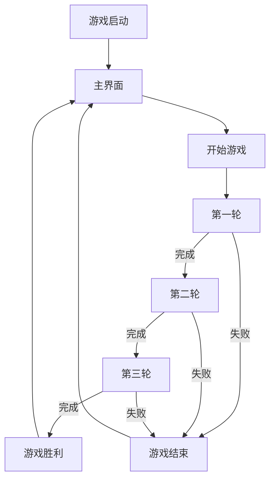

# 🚀 太空探险记忆翻翻乐 - 游戏设计文档 & PRD

## 文档说明
- **版本**：v1.0.1
- **最后更新**：2024-03
- **文档状态**：进行中
- **文档作者**：产品团队
- **文档目的**：为UI设计、原画设计、动画、音效、研发团队提供详细的开发规范

## 目录
1. [项目概述](#一项目概述)
2. [游戏系统](#二游戏系统)
3. [游戏界面设计](#三游戏界面设计)
4. [游戏文案设计](#四游戏文案设计)

## 一、项目概述

### 1.1 游戏定位
- **目标用户**：5-10岁儿童
- **游戏类型**：教育类记忆游戏
- **核心玩法**：太空主题的卡片配对游戏
- **教育目标**：提升记忆力、认知能力和专注力

### 1.2 游戏背景
玩家作为一名小小太空探险家，通过完成不同星球上的记忆配对任务，收集星星能量，探索浩瀚宇宙。

### 1.3 游戏特色
1. **🎮 创新玩法**
   - 三个难度递进的探索关卡
   - 单词与图像配对的创新玩法
   - 直观的卡片翻转动画
   - 实时的游戏进度显示

2. **👶 儿童友好设计**
   - 简单明了的操作方式
   - 大字体清晰的界面
   - 生动有趣的表情符号
   - 鼓励性的反馈机制
   - 适合儿童认知的难度曲线

3. **🤖 智能辅助系统**
   - Wordy机器人全程陪伴和引导
   - 动态表情反馈
   - 智能提醒功能
   - 个性化鼓励文案

### 1.4 产品定位
- **产品类型**：HTML5网页游戏
- **发布平台**：Web浏览器
- **商业模式**：教育免费
- **目标市场**：
  - 主要市场：5-10岁儿童
  - 次要市场：教育机构、家长

### 1.5 核心价值
1. **教育价值**
   - 记忆力训练
   - 注意力培养
   - 英语词汇学习
   - 逻辑思维发展

2. **娱乐价值**
   - 趣味性游戏体验
   - 成就感激励
   - 探索欲望满足

3. **社交价值**
   - 家长陪伴互动
   - 同伴竞争交流
   - 学习经验分享

## 二、游戏系统

### 2.1 核心玩法循环

#### 主循环设计
1. **探索阶段**
   - 玩家进入新的星球（关卡）
   - 观察并记忆卡片位置
   - 尝试匹配卡片对

2. **反馈循环**
   - 成功匹配 → 获得正向反馈 → 继续探索
   - 匹配失败 → 获得提示 → 重新尝试

3. **进阶机制**
   - 完成当前星球 → 解锁新星球
   - 获得星级评价 → 激励继续挑战

#### 循环目标与体验
- **短期目标**：找到匹配的卡片对
- **中期目标**：完成当前关卡的所有配对
- **长期目标**：通关所有三个星球并获得高星级评价
- **情感体验**：
  - 探索的好奇心
  - 成功匹配的成就感
  - 挑战完成的满足感

### 2.2 关卡设计

#### 探索模式（5-7岁）
- **卡片数量**：4张（2对）
- **时间限制**：120秒
- **难度定位**：入门级
- **教学目标**：培养基本记忆能力
- **关卡风格**：明亮、友好的蓝色星球
- **预期完成时间**：40-50秒
- **教学元素**：
  - 自动突出显示可点击的卡片
  - 简化的单词-图像配对
  - 详细的操作引导提示
  - 每30秒自动提示
  - 更多鼓励性反馈

#### 冒险模式（7-9岁）
- **卡片数量**：4张（2对）
- **时间限制**：90秒
- **难度定位**：进阶级
- **教学目标**：提升记忆效率
- **关卡风格**：神秘、温暖的红色星球
- **预期完成时间**：30-40秒
- **挑战元素**：
  - 适度的单词-图像关联
  - 减少引导提示
  - 每45秒自动提示
  - 平衡的反馈机制

#### 挑战模式（9-10岁）
- **卡片数量**：4张（2对）
- **时间限制**：60秒
- **难度定位**：挑战级
- **教学目标**：培养快速记忆能力
- **关卡风格**：奇异、神秘的紫色星球
- **预期完成时间**：20-30秒
- **挑战元素**：
  - 完整难度的单词-图像关联
  - 最小化提示系统
  - 每60秒自动提示
  - 强调成就反馈

### 2.3 计分系统

#### 星级评价机制
1. **三星评价**
   - **条件**：完成时间 ≤ 90秒
   - **视觉表现**：三颗金色星星，闪烁动画
   - **音效**：欢快的胜利音乐，持续5秒
   - **反馈**：金色星星特效 + "星际探险大师"称号
   - **解锁效果**：特殊徽章和表情
   - **奖励**：完整的彩带庆祝，屏幕闪烁

2. **二星评价**
   - **条件**：完成时间 ≤ 120秒
   - **视觉表现**：两颗银色星星，轻微闪烁
   - **音效**：中等欢快的胜利音乐，持续3秒
   - **反馈**：银色星星特效 + "太空探索者"称号
   - **解锁效果**：标准徽章
   - **奖励**：基础彩带庆祝

3. **一星评价**
   - **条件**：完成时间 > 120秒
   - **视觉表现**：一颗铜色星星，无特殊动画
   - **音效**：简单的完成音效，持续2秒
   - **反馈**：铜色星星特效 + "见习宇航员"称号
   - **奖励**：简单庆祝效果

#### 进度记录系统
- **关卡进度**：记录玩家已解锁的最高关卡
- **星级记录**：每个关卡的最高星级评价
- **时间记录**：每个关卡的最佳完成时间
- **成就系统**：根据累计表现授予特殊徽章

### 2.4 游戏状态流转

#### 主状态流程
```
开始界面 → 选择关卡 → 游戏进行 → 结算界面 → 返回选择/继续下一关
```

#### 详细状态流转


#### 状态转换条件
- **主界面→开始游戏**：点击"开始探索"按钮
- **关卡完成条件**：所有卡片对都被成功匹配
- **关卡失败条件**：计时器归零，未完成所有匹配
- **返回主界面条件**：点击"返回"按钮或完成/失败后自动返回

### 2.5 详细游戏规则

#### 核心规则
1. **卡片翻转机制**
   - 玩家每次只能翻开两张卡片
   - 翻开的卡片会显示其正面内容（单词或图像）
   - 每对卡片包含一个单词和一个对应的图像
   - 配对成功的卡片保持正面朝上
   - 配对失败的卡片延迟0.6秒后自动翻回

2. **配对判定规则**
   - 单词与其对应的图像构成有效配对
   - 例如："Apple"文字卡片与"🍎"图像卡片配对
   - 配对成功时卡片保持翻开状态并变为不可点击
   - 配对错误时卡片会短暂晃动，然后翻回背面

3. **关卡进度规则**
   - 所有卡片对匹配成功后关卡完成
   - 完成当前关卡后解锁下一关卡
   - 三个关卡全部完成后游戏胜利
   - 每关卡的完成情况独立记录和评分

#### 时间系统
1. **倒计时机制**
   - 每轮游戏90秒倒计时
   - 倒计时显示在界面顶部
   - 剩余30秒时倒计时变为红色并闪烁
   - 时间耗尽即为关卡失败

2. **时间奖惩机制**
   - 计时不会因匹配成功而增加
   - 剩余时间直接影响星级评价
   - 无暂停功能，确保游戏节奏流畅

#### 辅助规则
1. **提示系统**
   - 连续配对失败2次触发提示文字
   - 无操作15秒触发行动提醒
   - 剩余时间30秒时触发紧急提醒

2. **卡片分布规则**
   - 每局开始时卡片随机分布
   - 保证单词和图像均匀分布在棋盘上
   - 确保没有固定位置，增加记忆挑战

3. **进阶规则**
   - 连续配对成功会触发额外鼓励文字
   - 关卡越高，单词和图像的复杂度越高
   - 第三关的卡片需要更精确的记忆力

## 三、游戏界面设计

### 3.1 难度选择界面

#### 整体布局
- **垂直层次**：顶部标题区、中部选项区、底部控制区
- **布局比例**：2:7:1
- **设计原则**：直观、友好、色彩丰富

#### 界面元素
1. **顶部标题区**
   - 游戏标题："太空探险记忆翻翻乐"
   - 副标题："选择你的探险模式"
   - 背景：星空渐变
   - 动画：星星闪烁效果

2. **中部选项区**
   - **探索模式卡片**：
     - 背景：浅蓝色渐变
     - 图标：友好的火箭图标
     - 文字：大号字体"探索模式"
     - 说明：适合5-7岁小朋友
     - 特点：时间充足，提示更多
   - **冒险模式卡片**：
     - 背景：橙色渐变
     - 图标：标准的火箭图标
     - 文字：大号字体"冒险模式"
     - 说明：适合7-9岁小朋友
     - 特点：适度挑战，平衡提示
   - **挑战模式卡片**：
     - 背景：紫色渐变
     - 图标：高速火箭图标
     - 文字：大号字体"挑战模式"
     - 说明：适合9-10岁小朋友
     - 特点：快速记忆，最少提示

3. **底部控制区**
   - 返回按钮
   - 帮助按钮
   - 设置按钮

#### 交互设计
- **卡片悬停效果**：
  - 轻微放大（scale: 1.05）
  - 增加阴影
  - 边框发光
- **点击效果**：
  - 下沉动画
  - 波纹扩散
  - 音效反馈
- **选中状态**：
  - 发光边框
  - 持续动画
  - 高亮显示
- **过渡动画**：
  - 平滑缩放
  - 渐入渐出
  - 卡片滑动

### 3.2 主界面布局

#### 整体布局
- **垂直层次**：顶部信息栏、主游戏区、底部控制栏
- **布局比例**：2:8:1
- **设计原则**：扁平化、直观、色彩丰富

#### 顶部信息栏设计
```
┌─────────────────────────────────────┐
│  🚀 探索进度：5/9     ⏱️ 90s      │
│  [=========>------------------]     │
└─────────────────────────────────────┘
```

**功能需求**：
- 显示当前游戏总体进度
- 显示剩余时间倒计时
- 提供直观的进度可视化
- 在时间紧迫时提供视觉警告

**设计规格**：
- 尺寸：宽100%，高80px
- 背景：深蓝色渐变（#1a1a2e → #16213e）
- 边框：2px实线（#4CAF50）
- 圆角：20px
- 阴影：0 4px 10px rgba(0, 0, 0, 0.3)
- 内边距：15px

**组件详情**：
1. **进度文本**
   - 位置：左侧
   - 字体：24px Arial, sans-serif
   - 颜色：白色（#ffffff）
   - 图标：火箭emoji（🚀）带上下浮动动画
   - 内容格式："探索进度：X/9"（X为当前完成的配对总数）

2. **时间显示**
   - 位置：右侧
   - 字体：24px Arial, sans-serif, 粗体
   - 常规颜色：白色（#ffffff）
   - 紧急颜色：红色（#ff4757）
   - 图标：计时器emoji（⏱️）
   - 内容格式："XXs"（XX为剩余秒数）
   - 紧急状态：剩余≤30秒时文字变红并闪烁

3. **进度条**
   - 宽度：100%
   - 高度：20px
   - 背景色：半透明白色（rgba(255,255,255,0.1)）
   - 填充色：渐变绿色（#4CAF50 → #8BC34A）
   - 圆角：10px
   - 动画：进度更新时平滑过渡（0.3s）
   - 特效：流光动画（1.5s循环）

**交互规则**：
- 进度条随匹配成功而实时更新
- 时间显示每秒更新一次
- 倒计时≤30秒时触发视觉警告

#### 游戏主区域设计
```
┌─────────────────────────────────────┐
│     [卡片1]        [卡片2]         │
│                                     │
│     [卡片3]        [卡片4]         │
│                                     │
│     [卡片5]        [卡片6]         │
│                                     │
│     [卡片7]        [卡片8]         │
└─────────────────────────────────────┘
```

**功能需求**：
- 展示所有游戏卡片
- 支持卡片翻转交互
- 适应不同数量的卡片排列
- 显示配对结果反馈
- 提供足够的卡片操作空间

**设计规格**：
- 尺寸：宽100%，高自适应
- 背景：半透明深色（rgba(0,0,0,0.2)）
- 边距：上下20px，左右10px
- 布局：网格布局，2列均匀分布
- 间距：卡片间隙15px

**组件详情**：
1. **卡片网格**
   - 布局：CSS Grid
   - 列数：固定2列
   - 行数：根据关卡动态调整（2-4行）
   - 内边距：20px
   - 对齐：卡片居中

2. **消息显示区**
   - 位置：卡片区域上方中央悬浮
   - 背景：半透明深色（rgba(0,0,0,0.7)）
   - 字体：20px Arial, sans-serif
   - 颜色：白色（#ffffff）
   - 圆角：15px
   - 动画：淡入淡出（0.3s）
   - 显示时长：2秒

**交互规则**：
- 卡片可点击翻转
- 已配对卡片不可再次点击
- 最多同时翻转两张卡片
- 匹配结果反馈在消息显示区呈现

#### 底部控制栏设计
```
┌─────────────────────────────────────┐
│            [开始探索]              │
└─────────────────────────────────────┘
```

**功能需求**：
- 提供游戏启动控制
- 游戏结束后提供重新开始选项
- 界面简洁明了，避免过多按钮干扰
- 按钮设计适合儿童点击操作

**设计规格**：
- 尺寸：宽100%，高80px
- 背景：深蓝色（#16213e）
- 内边距：15px
- 对齐：按钮居中

**组件详情**：
1. **开始探索按钮**
   - 尺寸：200px × 50px
   - 背景：渐变绿色（#4CAF50 → #8BC34A）
   - 字体：20px Arial, sans-serif, 粗体
   - 颜色：白色（#ffffff）
   - 圆角：25px
   - 阴影：0 4px 6px rgba(0,0,0,0.1)
   - 悬停效果：轻微放大（1.05倍）
   - 文字：不同状态显示"开始探索"、"继续探索"或"重新探索"

**交互规则**：
- 游戏开始前显示"开始探索"按钮
- 游戏进行中隐藏所有按钮
- 游戏结束或胜利后显示相应按钮
- 点击按钮有按压反馈动画

### 3.3 卡片设计

#### 卡片外观规格

**卡片正面**
- **尺寸**：120px × 160px
- **内容区**：100px × 140px
- **圆角**：12px
- **边框**：3px立体效果（#4CAF50）
- **背景**：白色（#ffffff）
- **阴影**：0 4px 8px rgba(0,0,0,0.2)
- **内边距**：10px

**卡片类型**：
1. **文字卡片**
   - 字体：16px Arial, sans-serif, 粗体
   - 文字颜色：深蓝色（#1a1a2e）
   - 对齐：居中
   - 内容：英文单词，首字母大写
   - 背景：浅蓝色渐变（#e6f7ff → #ccefff）

2. **图像卡片**
   - 字体：32px（表情符号大小）
   - 对齐：居中
   - 内容：对应单词的表情符号
   - 背景：浅绿色渐变（#e6ffee → #ccffdd）

**卡片背面**
- 统一的太空主题图案
- 背景：深蓝色（#1a1a2e）与星星点缀
- 中央图案：小火箭或星球图标
- 边框：3px立体效果（#4CAF50）
- 光泽：轻微渐变效果
- 阴影：内阴影营造立体感

#### 卡片状态设计

**默认状态**
- 显示卡片背面
- 轻微悬浮阴影
- 可点击状态

**悬停状态**
- 轻微放大（1.05倍）
- 阴影增强
- 微弱发光效果（0.3s过渡）

**翻开状态**
- 显示卡片正面（单词或图像）
- 执行3D翻转动画
- 撤销放大效果

**匹配成功状态**
- 保持正面朝上
- 添加绿色发光边框
- 不可点击状态
- 短暂的放大后恢复原状

**匹配失败状态**
- 触发晃动动画
- 延迟0.6秒后翻回背面
- 恢复默认状态

### 3.4 动画系统

#### 状态指示动画

**火箭浮动动画**
- **目的**：提高顶部信息栏的趣味性，吸引注意力
- **元素**：进度文本前的火箭图标（🚀）
- **规格**：
  - 类型：Y轴上下浮动
  - 持续时间：2s
  - 浮动距离：5px
  - 循环：无限循环
  - 缓动函数：ease-in-out
- **CSS代码**：
  ```css
  @keyframes float {
    0% { transform: translateY(0); }
    50% { transform: translateY(-5px); }
    100% { transform: translateY(0); }
  }
  .rocket {
    animation: float 2s ease-in-out infinite;
  }
  ```

**进度条流光动画**
- **目的**：增强进度条视觉吸引力，提供动态效果
- **元素**：进度条填充部分
- **规格**：
  - 类型：横向流动渐变
  - 持续时间：1.5s
  - 效果：光带从左向右流动
  - 循环：无限循环
  - 覆盖范围：整个进度条填充区域
- **CSS代码**：
  ```css
  @keyframes shine {
    0% { background-position: -200% center; }
    100% { background-position: 200% center; }
  }
  .progress-fill {
    background: linear-gradient(90deg, #4CAF50, #8BC34A, #4CAF50);
    background-size: 200% auto;
    animation: shine 1.5s linear infinite;
  }
  ```

**倒计时紧急动画**
- **目的**：当时间不足时提醒玩家
- **元素**：倒计时显示
- **规格**：
  - 类型：颜色闪烁
  - 触发条件：剩余时间 ≤ 30秒
  - 颜色：#ff4757（红色）
  - 动画持续时间：1s
  - 循环：时间小于30秒时无限循环
  - 效果：透明度和颜色饱和度变化
- **CSS代码**：
  ```css
  @keyframes pulse {
    0% { opacity: 1; }
    50% { opacity: 0.7; }
    100% { opacity: 1; }
  }
  .timer-display.urgent {
    color: #ff4757;
    animation: pulse 1s infinite;
  }
  ```

#### 卡片动画

**翻转效果**
- **目的**：提供视觉反馈，显示卡片内容
- **元素**：游戏卡片
- **规格**：
  - 类型：3D翻转（Y轴）
  - 持续时间：0.3s
  - 缓动函数：ease-out
  - 触发条件：点击未翻开卡片
  - 视觉效果：卡片背面到正面的平滑翻转
- **CSS代码**：
  ```css
  .card {
    transition: transform 0.3s ease-out;
    transform-style: preserve-3d;
  }
  .card.flipped {
    transform: rotateY(180deg);
  }
  ```

**匹配失败晃动**
- **目的**：提供错误配对的视觉反馈
- **元素**：配对失败的卡片
- **规格**：
  - 类型：横向晃动
  - 持续时间：0.3s
  - 晃动幅度：8px
  - 触发条件：两张卡片不匹配
  - 缓动函数：ease-in-out
- **CSS代码**：
  ```css
  @keyframes shake {
    0%, 100% { transform: translateX(0); }
    20%, 60% { transform: translateX(-8px); }
    40%, 80% { transform: translateX(8px); }
  }
  .card.shake {
    animation: shake 0.3s ease-in-out;
  }
  ```

#### 反馈动画

**匹配成功动画**
- **目的**：庆祝成功配对，提供积极反馈
- **元素**：成功配对的卡片和彩带特效
- **规格**：
  - 类型：彩带庆祝
  - 持续时间：2s
  - 彩带数量：30个
  - 触发条件：成功配对
  - 效果范围：匹配卡片周围
- **实现方式**：
  ```javascript
  function createMatchConfetti() {
    // 创建30个彩带元素
    for (let i = 0; i < 30; i++) {
      const confetti = document.createElement('div');
      confetti.className = 'confetti';
      // 随机颜色和位置
      confetti.style.backgroundColor = getRandomColor();
      confetti.style.left = `${Math.random() * 100}%`;
      confetti.style.animationDuration = `${Math.random() * 1 + 1}s`;
      document.getElementById('confetti-container').appendChild(confetti);
      
      // 动画结束后移除元素
      setTimeout(() => {
        confetti.remove();
      }, 2000);
    }
  }
  ```

**关卡完成动画**
- **目的**：庆祝玩家完成关卡，提供成就感
- **元素**：全屏特效和星级评价
- **规格**：
  - 类型：星星评价 + 全屏庆祝
  - 持续时间：3s
  - 特效元素：彩带、星星、闪光
  - 触发条件：完成所有配对
  - 覆盖范围：整个游戏区域
- **视觉表现**：
  - 背景变暗，突出胜利消息
  - 星星从顶部飘落
  - 彩带从两侧喷射
  - 评价星级随音效依次出现
  - 适当延迟后显示继续按钮

### 3.5 视觉主题

#### 太空探险视觉体系

**总体风格**：
- 深邃的太空背景
- 明亮的功能元素
- 鲜明的主题对比
- 生动的动画效果
- 趣味性表情符号

**背景设计**：
- 主背景：深蓝色渐变（#0B1026 → #262B44）
- 星星效果：小型白色光点，随机分布
- 远景星云：半透明紫色光晕
- 行星装饰：作为视觉元素出现在角落

**色彩系统**：
- **主色**：
  - 深空蓝：#1a1a2e（背景和框架）
  - 星际紫：#16213e（卡片背面和装饰）
  - 能量绿：#4CAF50（强调色和按钮）
  - 星尘白：#ffffff（文字和图标）

- **辅助色**：
  - 警示红：#ff4757（警告和紧急提示）
  - 卡片蓝：#e6f7ff（文字卡片背景）
  - 卡片绿：#e6ffee（图像卡片背景）
  - 月岩灰：#808080（次要文本）

**光效处理**：
- 卡片有轻微发光效果
- 按钮有柔和光晕
- 成功匹配时有绿色闪光
- 进度条有流光动画
- 所有元素有恰当的投影

### 3.6 提示系统

#### 连续失误提示
- **触发条件**：连续2次匹配失败
- **显示位置**：屏幕中央
- **显示时长**：2s
- **提示类型**：文字 + 表情
- **视觉设计**：
  - 背景：半透明深色框（rgba(0,0,0,0.7)）
  - 字体：20px Arial, sans-serif
  - 颜色：白色（#ffffff）
  - 图标：思考表情（🤔）
  - 淡入淡出：0.3s
- **文案示例**：
  - "别着急，仔细观察一下 🤔"
  - "需要帮助吗？试试记住卡片的位置 💭"

#### 超时提示
- **触发条件**：15秒无操作
- **显示位置**：屏幕中央
- **显示时长**：3s
- **提示类型**：文字 + 动画
- **视觉设计**：
  - 背景：半透明深色框（rgba(0,0,0,0.7)）
  - 字体：22px Arial, sans-serif
  - 颜色：白色（#ffffff）
  - 图标：火箭表情（🚀）
  - 淡入淡出：0.5s
  - 轻微弹跳：上下3px
- **文案示例**：
  - "嘿，我们继续探索吧！ 🚀"
  - "快来继续我们的太空冒险！ 🌠"

#### 时间提醒
- **触发条件**：剩余30秒
- **显示位置**：
  - 主要：倒计时数字变红
  - 辅助：屏幕中央弹出提示
- **显示效果**：
  - 文字颜色：#ff4757（红色）
  - 动画：脉冲效果（1s循环）
  - 背景：带有淡红色边框的半透明框
- **提示类型**：
  - 视觉：颜色变化 + 动画
  - 文字：紧急提示消息
- **文案示例**：
  - "⏰ 加油加油，你可以的！"
  - "⏱️ 时间不多了，快点完成探索！"

### 3.7 视觉主题

#### 太空探险视觉体系

**总体风格**：
- 深邃的太空背景
- 明亮的功能元素
- 鲜明的主题对比
- 生动的动画效果
- 趣味性表情符号

**背景设计**：
- 主背景：深蓝色渐变（#0B1026 → #262B44）
- 星星效果：小型白色光点，随机分布
- 远景星云：半透明紫色光晕
- 行星装饰：作为视觉元素出现在角落

**色彩系统**：
- **主色**：
  - 深空蓝：#1a1a2e（背景和框架）
  - 星际紫：#16213e（卡片背面和装饰）
  - 能量绿：#4CAF50（强调色和按钮）
  - 星尘白：#ffffff（文字和图标）

- **辅助色**：
  - 警示红：#ff4757（警告和紧急提示）
  - 卡片蓝：#e6f7ff（文字卡片背景）
  - 卡片绿：#e6ffee（图像卡片背景）
  - 月岩灰：#808080（次要文本）

**光效处理**：
- 卡片有轻微发光效果
- 按钮有柔和光晕
- 成功匹配时有绿色闪光
- 进度条有流光动画
- 所有元素有恰当的投影

### 3.8 UI规范

#### 色彩规范
- **主色调**：
  - 深空蓝：#1a1a2e
  - 星际紫：#16213e
  - 能量绿：#4CAF50
  - 警示红：#ff4757

- **辅助色**：
  - 星尘白：#ffffff
  - 月岩灰：#808080
  - 陨石黑：#000000

#### 字体规范
- **主标题**：
  - 字体：Arial, sans-serif
  - 大小：32px
  - 粗细：Bold
  - 颜色：#ffffff

- **次标题**：
  - 字体：Arial, sans-serif
  - 大小：24px
  - 粗细：SemiBold
  - 颜色：#ffffff

- **正文**：
  - 字体：Arial, sans-serif
  - 大小：16px
  - 粗细：Regular
  - 颜色：#ffffff

#### 图标规范
- **功能图标**：
  - 尺寸：32x32px
  - 风格：线性+填充
  - 圆角：4px

- **装饰图标**：
  - 尺寸：24x24px
  - 风格：扁平化
  - 动效：悬浮缩放

#### 按钮规范
- **主要按钮**：
  - 尺寸：200x50px
  - 圆角：25px
  - 背景：渐变（#4CAF50 → #8BC34A）
  - 阴影：0 4px 6px rgba(0,0,0,0.1)

- **次要按钮**：
  - 尺寸：160x40px
  - 圆角：20px
  - 背景：半透明（rgba(255,255,255,0.1)）
  - 阴影：0 2px 4px rgba(0,0,0,0.1)

### 3.9 响应式设计要求

#### 屏幕适配规则
- **桌面端**（>1024px）
  - 卡片尺寸：120px × 160px
  - 布局：2列网格
  - 间距：15px

- **平板端**（768px-1024px）
  - 卡片尺寸：100px × 140px
  - 布局：2列网格
  - 间距：12px

- **移动端**（<768px）
  - 卡片尺寸：80px × 120px
  - 布局：2列网格
  - 间距：8px

#### 关键交互适配
- 桌面端：鼠标点击和悬停效果
- 平板/移动端：触摸优化，增大可点击区域
- 移动端纵向：自动调整至适合单手操作
- 移动端横向：优化为两手拇指操作模式

#### 内容流动规则
- 文本自动调整大小
- 图像和卡片按比例缩放
- 界面元素保持一致的间距比例
- 优先确保游戏区域可见和可操作

## 四、游戏文案设计

### 4.1 文案风格指南

#### 总体风格定位
- **语气**：友好、鼓励、活泼
- **表达方式**：简洁明了、生动有趣
- **目标受众**：5-10岁儿童
- **核心特点**：
  - 太空探险主题贯穿始终
  - 使用简单词汇确保理解
  - 积极鼓励的表达方式
  - 适量使用emoji增强趣味性
  - 避免消极或批评性语言

#### 文案调性标准
- **友好度**：★★★★★（非常友好）
- **活泼度**：★★★★☆（较为活泼）
- **专业度**：★★☆☆☆（适度专业）
- **趣味性**：★★★★★（非常有趣）
- **简洁度**：★★★★☆（较为简洁）

#### 表情符号使用规范
- 每条文案最多使用1-2个emoji
- emoji放置在文案末尾或关键词后
- 优先使用太空相关表情：🚀 🌟 🌠 🌍 🛸 ⭐ 🪐
- 鼓励类表情：👏 ✨ 🎯 🧠 💫
- 提示类表情：🤔 💭 ⏱️ ⏰

### 4.2 难度选择文案

#### 模式选择提示
- **探索模式**：
  - 标题：探索模式 🚀
  - 描述：适合5-7岁小朋友，有充足的时间探索太空！
  - 特点：时间充足，提示更多，轻松愉快
  - 按钮：开始探索

- **冒险模式**：
  - 标题：冒险模式 🚀
  - 描述：适合7-9岁小朋友，来一场刺激的太空冒险！
  - 特点：适度挑战，平衡提示，充满乐趣
  - 按钮：开始冒险

- **挑战模式**：
  - 标题：挑战模式 🚀
  - 描述：适合9-10岁小朋友，展现你的太空探险实力！
  - 特点：快速记忆，最少提示，考验能力
  - 按钮：开始挑战

#### 模式切换提示
- 进入新模式的欢迎语：
  - 探索模式："欢迎来到探索模式！让我们一起轻松探索太空吧！"
  - 冒险模式："准备好开始冒险了吗？让我们探索更远的太空！"
  - 挑战模式："挑战模式启动！展现你的太空探险实力！"

- 模式切换确认：
  - "确定要切换到[模式名称]吗？"
  - "这将开始新的太空探险！"

### 4.3 游戏提示文案

#### 1. 开始/结束提示
- **游戏开始**：
  ```
  准备好探索太空了吗？ 🚀
  ```
  - **场景**：点击"开始探索"按钮后
  - **显示位置**：屏幕中央
  - **显示时长**：2秒
  - **动画效果**：淡入淡出

- **游戏结束**：
  ```
  游戏结束！时间到了！⏰
  ```
  - **场景**：倒计时归零
  - **显示位置**：屏幕中央
  - **显示时长**：3秒
  - **动画效果**：放大淡入

- **胜利提示**：
  ```
  太棒了！你完成了探索！✨
  ```
  - **场景**：所有关卡完成
  - **显示位置**：屏幕中央，胜利界面上方
  - **显示时长**：持续显示直到点击按钮
  - **动画效果**：渐变色文字，轻微跳动

#### 2. 进度提示
- **第一关进入**：
  ```
  欢迎来到启程星球！找出匹配的卡片吧 🌍
  ```
  - **场景**：第一关开始
  - **显示位置**：屏幕中央
  - **显示时长**：2.5秒

- **第二关进入**：
  ```
  欢迎来到探索星球！挑战更多卡片 🪐
  ```
  - **场景**：第二关开始
  - **显示位置**：屏幕中央
  - **显示时长**：2.5秒

- **第三关进入**：
  ```
  欢迎来到挑战星球！最后的探险开始了 🌠
  ```
  - **场景**：第三关开始
  - **显示位置**：屏幕中央
  - **显示时长**：2.5秒

- **关卡完成**：
  ```
  太棒了！准备好开始下一次探索了吗？ 🎯
  ```
  - **场景**：单个关卡完成
  - **显示位置**：屏幕中央
  - **显示时长**：1.5秒
  - **动画效果**：从下向上滑入

- **进度显示**：
  ```
  探索进度：X/9
  ```
  - **场景**：游戏进行中
  - **显示位置**：顶部信息栏
  - **动态更新**：随配对成功而更新

#### 3. 时间提示
- **常规显示**：
  ```
  90s
  ```
  - **场景**：游戏进行中
  - **显示位置**：顶部信息栏右侧
  - **更新频率**：每秒

- **紧急提示**（剩余≤30秒）：
  ```
  加油加油，你可以的！⏱️
  ```
  - **场景**：剩余时间不足30秒
  - **显示位置**：屏幕中央
  - **显示时长**：2秒
  - **动画效果**：警示性闪烁
  - **附加效果**：倒计时数字变红并闪烁

- **时间不足**（剩余≤10秒）：
  ```
  ⏰ 时间不多了，快点完成探索！
  ```
  - **场景**：剩余时间不足10秒
  - **显示位置**：屏幕中央
  - **显示时长**：2秒
  - **动画效果**：警示性闪烁
  - **附加效果**：倒计时数字放大闪烁

#### 4. 匹配反馈

##### 成功匹配鼓励语
```javascript
const encouragements = [
    "太棒了！继续保持 🌟",
    "你真厉害！ 👏",
    "完美配对！ ✨",
    "好眼力！ 🎯",
    "太空探索进行中... 🚀",
    "智慧小天才！ 🧠",
    "继续前进！ ⭐",
    "探索的脚步不停歇！ 🌠"
];
```

- **场景**：成功匹配卡片对
- **显示位置**：屏幕中央
- **显示时长**：1.5秒
- **随机选择**：从数组中随机选择一条
- **动画效果**：轻微弹跳并淡出

##### 连续成功匹配（2次以上）
```javascript
const comboEncouragements = [
    "连续匹配！太厉害了！ 🔥",
    "探索天赋爆发！ 💫",
    "完美表现！继续保持！ ⚡",
    "你是天生的探险家！ 🚀"
];
```

- **场景**：连续成功匹配2次以上
- **显示位置**：屏幕中央
- **显示时长**：1.5秒
- **附加效果**：文字放大并添加光晕

##### 失败提示
- **首次失败**：
  ```
  没关系，再试一次 🙂
  ```
  - **场景**：首次匹配失败
  - **显示位置**：屏幕中央
  - **显示时长**：1秒
  - **动画效果**：轻微淡入淡出

- **连续失败**（2次）：
  ```
  别着急，仔细观察一下 🤔
  ```
  - **场景**：连续2次匹配失败
  - **显示位置**：屏幕中央
  - **显示时长**：2秒
  - **动画效果**：缓慢淡入

- **多次失败**（3次以上）：
  ```
  需要帮助吗？试试记住卡片的位置 💭
  ```
  - **场景**：连续3次以上匹配失败
  - **显示位置**：屏幕中央
  - **显示时长**：2.5秒
  - **动画效果**：边框突出显示

#### 5. 胜利评价

- **三星评价**：
  - **称号**：
    ```
    星际探险大师
    ```
  - **提示**：
    ```
    哇！你是最棒的太空探险家！ 🌟🌟🌟
    ```
  - **场景**：完成时间 ≤ 90秒
  - **显示位置**：胜利界面
  - **动画效果**：金色星星闪烁
  - **附加效果**：完整彩带庆祝

- **二星评价**：
  - **称号**：
    ```
    太空探索者
    ```
  - **提示**：
    ```
    做得很好！继续加油！ 🌟🌟
    ```
  - **场景**：完成时间 ≤ 120秒
  - **显示位置**：胜利界面
  - **动画效果**：银色星星亮起
  - **附加效果**：基础彩带效果

- **一星评价**：
  - **称号**：
    ```
    见习宇航员
    ```
  - **提示**：
    ```
    你已经很棒了，下次一定更好！ 🌟
    ```
  - **场景**：完成时间 > 120秒
  - **显示位置**：胜利界面
  - **动画效果**：铜色星星显示
  - **附加效果**：简单庆祝动画

#### 6. 超时提醒

- **无操作提示**（15秒无操作）：
  ```
  嘿，我们继续探索吧！ 🚀
  ```
  - **场景**：15秒无操作
  - **显示位置**：屏幕中央
  - **显示时长**：3秒
  - **动画效果**：渐入并轻微弹跳

- **继续提醒**（30秒无操作）：
  ```
  快来继续我们的太空冒险！ 🌠
  ```
  - **场景**：30秒无操作
  - **显示位置**：屏幕中央
  - **显示时长**：3秒
  - **动画效果**：放大并突出显示

### 4.4 按钮文案

#### 游戏控制按钮
- **开始按钮**：
  ```
  开始探索
  ```
  - **场景**：游戏初始界面
  - **字体**：20px Arial, sans-serif, 粗体
  - **颜色**：白色（#ffffff）

- **重新开始**：
  ```
  重新探索
  ```
  - **场景**：游戏结束后
  - **字体**：20px Arial, sans-serif, 粗体
  - **颜色**：白色（#ffffff）

- **下一关**：
  ```
  前往下一个星球
  ```
  - **场景**：关卡完成后
  - **字体**：18px Arial, sans-serif, 粗体
  - **颜色**：白色（#ffffff）

- **返回主页**：
  ```
  返回太空站
  ```
  - **场景**：游戏任意阶段
  - **字体**：16px Arial, sans-serif
  - **颜色**：白色（#ffffff）

### 4.5 成就系统文案

#### 成就提示
- **完美通关**：
  ```
  完美的太空探索！你获得了所有星星！
  ```
  - **条件**：所有关卡获得三星评价
  - **图标**：金色奖杯 🏆
  - **动画**：星星环绕效果

- **快速完成**：
  ```
  光速般的探索！你是最快的探险家！
  ```
  - **条件**：总时间小于3分钟通关
  - **图标**：闪电 ⚡
  - **动画**：速度线条效果

- **新手完成**：
  ```
  探索之旅开启！你的冒险才刚刚开始！
  ```
  - **条件**：首次完成游戏
  - **图标**：火箭 🚀
  - **动画**：缓慢上升效果

### 4.6 错误提示文案

#### 系统错误
- **操作错误**：
  ```
  哎呀，这里好像不对...请再试一次！
  ```
  - **场景**：无效操作
  - **显示风格**：淡入淡出提示

- **系统错误**：
  ```
  遇到了一些小问题，让我们重新开始吧！
  ```
  - **场景**：系统功能异常
  - **显示风格**：持续显示，带刷新按钮

### 4.7 帮助提示文案

#### 游戏指导
- **新手引导**：
  ```
  点击卡片，寻找匹配的单词和图片！配对成功的卡片会保持朝上！
  ```
  - **场景**：首次进入游戏
  - **显示风格**：分步骤指导，带箭头指示

- **操作提示**：
  ```
  记住卡片的位置，找到它们的伙伴！单词和对应的图片可以配对！
  ```
  - **场景**：游戏帮助按钮
  - **显示风格**：图文并茂的提示框

- **规则说明**：
  ```
  在规定时间内完成配对，获得更多星星！时间越多，星星越多！
  ```
  - **场景**：规则说明界面
  - **显示风格**：分点式说明

### 4.8 卡片内容配置

#### 单词-图像配对表
| 序号 | 单词 | 图像 | 难度 |
|------|------|------|------|
| 1 | Apple | 🍎 | 简单 |
| 2 | Banana | 🍌 | 简单 |
| 3 | Cat | 🐱 | 简单 |
| 4 | Dog | 🐶 | 简单 |
| 5 | Elephant | 🐘 | 中等 |
| 6 | Fish | 🐠 | 中等 |
| 7 | Giraffe | 🦒 | 困难 |
| 8 | House | 🏠 | 中等 |

#### 单词分配规则
- **第一关**：使用序号1-2的简单单词
- **第二关**：使用序号3-5的简单到中等单词
- **第三关**：使用序号6-9的中等到困难单词
- **单词样式**：首字母大写，其余小写
- **单词字体**：16px Arial, sans-serif, 粗体

### 4.9 本地化支持

#### 语言支持计划
- **第一阶段**：简体中文、英文
- **第二阶段**：繁体中文、日文、韩文
- **第三阶段**：法文、德文、西班牙文

#### 文案本地化注意事项
- 保持表情符号一致
- 调整文本长度适应不同语言
- 确保按钮文本不溢出
- 提供可配置的字体大小
- 考虑从右到左语言的布局支持

## 五、技术实现

### 5.1 技术架构

#### 1. 前端架构
```
├── index.html          # 入口文件
├── assets/            # 资源文件
│   ├── images/       # 图片资源
│   ├── sounds/       # 音效资源
│   └── styles/       # 样式文件
├── scripts/          # 脚本文件
│   ├── game.js      # 游戏核心逻辑
│   ├── animation.js # 动画控制
│   ├── sound.js     # 音效控制
│   └── utils.js     # 工具函数
└── styles/          # 样式文件
    ├── main.css     # 主样式
    └── animations.css # 动画样式
```

#### 2. 核心类设计
```javascript
class MemoryGame {
    constructor() {
        this.currentRound = 1;
        this.timeLeft = 90;
        this.matchedPairs = 0;
        this.cards = [];
        this.flippedCards = [];
        this.isPlaying = false;
    }

    // 游戏初始化
    init() {
        this.setupEventListeners();
        this.loadResources();
        this.showStartScreen();
    }

    // 开始新游戏
    startGame() {
        this.resetGameState();
        this.createBoard();
        this.startTimer();
        this.showGameScreen();
    }

    // 检查卡片匹配
    checkMatch() {
        const [card1, card2] = this.flippedCards;
        return this.compareCards(card1, card2);
    }

    // 结束游戏
    endGame() {
        this.stopTimer();
        this.calculateScore();
        this.showEndScreen();
    }
}

class AnimationController {
    // 动画控制相关方法
}

class SoundController {
    // 音效控制相关方法
}

class UIController {
    // UI控制相关方法
}
```

#### 3. 状态管理
```javascript
const GameState = {
    IDLE: 'idle',
    PLAYING: 'playing',
    PAUSED: 'paused',
    ENDED: 'ended'
};

const CardState = {
    HIDDEN: 'hidden',
    FLIPPED: 'flipped',
    MATCHED: 'matched'
};
```

### 5.2 性能优化
1. **动画性能**
   - 使用CSS transform
   - 启用硬件加速
   - 优化重绘次数
   - 及时清理动画元素

2. **内存管理**
   - 及时清理定时器
   - 移除未使用的DOM元素
   - 优化事件监听器
   - 控制动态元素数量

3. **响应优化**
   - 防抖处理
   - 延迟加载
   - 状态缓存

### 5.3 测试规范

#### 1. 单元测试
- 核心游戏逻辑测试
- 动画系统测试
- 音效系统测试

#### 2. 集成测试
- 游戏流程测试
- 状态转换测试
- 资源加载测试

#### 3. 性能测试
- 内存占用测试
- 动画性能测试
- 响应速度测试

#### 4. 兼容性测试
- 浏览器兼容性测试
- 设备适配性测试
- 分辨率适配测试

## 六、开发指南

### 6.1 项目结构
```
project/
├── pages/
│   └── game.html    # 游戏主文件
├── assets/
│   ├── images/      # 图片资源
│   ├── sounds/      # 音效资源
│   └── styles/      # 样式文件
└── README.md        # 项目文档
```